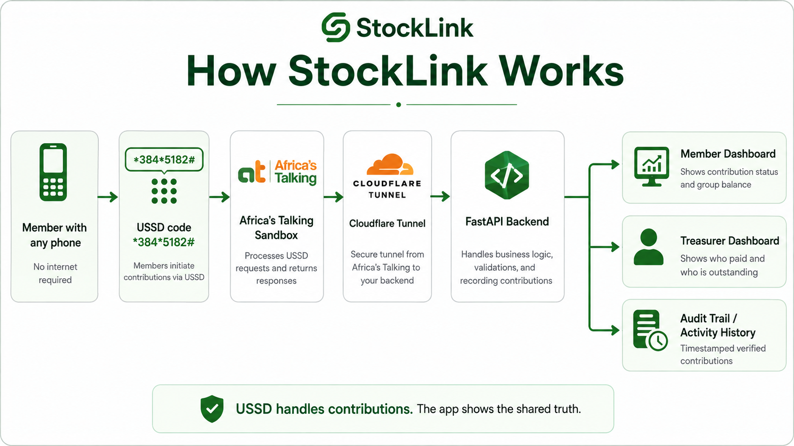
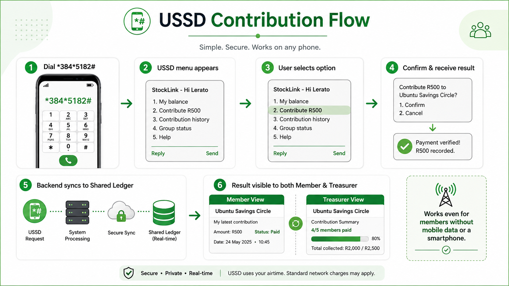
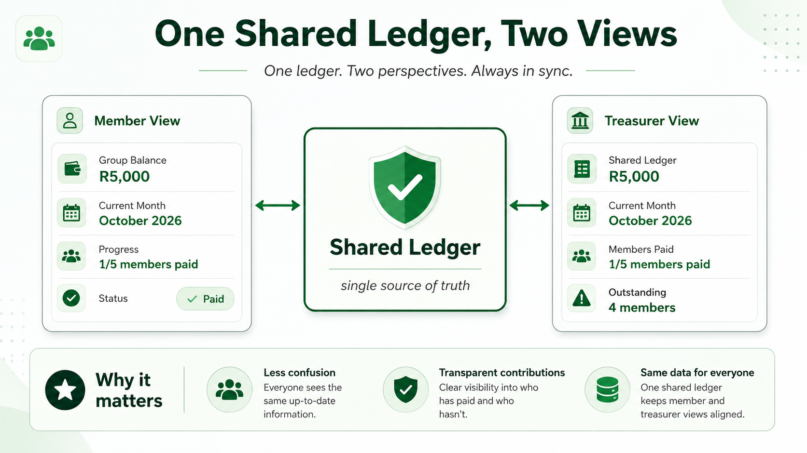

# StockLink

**StockLink** is a fintech prototype that makes stokvel contributions more accessible, transparent, and easy to track.

Members contribute through **USSD**, while members and treasurers see the same contribution activity through a **shared digital ledger**.

> Whether a member has a smartphone, mobile data, or only a basic phone, they can participate in the same financial system.

---

## How StockLink Works



StockLink connects a member's USSD session to the same backend and shared ledger used by the member and treasurer dashboards.

---

## The Problem

Many stokvels still rely on paper books, WhatsApp messages, cash deposits, and screenshots to track contributions.

This creates challenges such as:

- Poor contribution visibility
- Manual reconciliation
- Disputes about who has paid
- Limited access for members without mobile data
- No shared, transparent audit trail

---

## Our Solution

StockLink combines:

- **USSD contribution access**
- **Shared contribution ledger**
- **Member dashboard**
- **Treasurer dashboard**
- **Contribution history**
- **Audit trail**
- **Monthly contribution tracking**

The prototype focuses on one clear journey: **a member contributes R500 through USSD and the contribution becomes visible across the shared system.**

---

## USSD Contribution Flow



### Demo Flow

1. Member dials `*384*5182#`
2. Selects **Contribute R500**
3. Confirms the contribution
4. StockLink records the verified contribution
5. The shared ledger updates
6. The member's monthly status changes to **Paid**
7. The treasurer dashboard updates
8. The transaction appears in the activity/audit history

### Demo USSD Code

```text
*384*5182#
```

The USSD interaction is demonstrated using the **Africa's Talking Sandbox**.

---

## One Shared Ledger, Two Views



The member and treasurer views read from the same ledger, keeping contribution information synchronized and transparent.

---

## Core Features

### Member

- View current contribution status
- View shared ledger balance
- See the current contribution month
- View contribution history
- Track verified USSD contributions

### Treasurer

- View the shared verified contribution ledger
- See how many members have paid
- Identify outstanding members
- Monitor monthly contribution progress
- View transaction activity

### USSD

```text
1. My balance
2. Contribute R500
3. Contribution history
4. Group status
5. Help
```

---

## Technology Stack

| Layer | Technology |
|---|---|
| Frontend | React Native, Expo, TypeScript |
| Backend | Python, FastAPI, SQLAlchemy |
| Database | SQLite |
| USSD | Africa's Talking Sandbox |
| Connectivity | Cloudflare Tunnel |
| API | REST API |

---

## Architecture

```text
Member / Basic Phone
        |
        | USSD
        v
Africa's Talking Sandbox
        |
        v
Cloudflare Tunnel
        |
        v
FastAPI Backend
        |
        v
SQLite / Shared Ledger
        |
        +-----------------------+
        |                       |
        v                       v
Member Dashboard        Treasurer Dashboard
        |
        v
Audit / Activity History
```

---

## Project Structure

```text
StockLink/
├── backend/
│   ├── app/
│   │   ├── main.py
│   │   ├── database.py
│   │   ├── models.py
│   │   ├── schemas.py
│   │   └── seed.py
│   └── requirements.txt
├── mobile/
│   ├── App.tsx
│   └── src/
├── assets/
│   ├── how-stocklink-works.png
│   ├── ussd-contribution-flow.png
│   └── shared-ledger-two-views.png
└── README.md
```

---

## Running the Prototype

### 1. Start FastAPI

```powershell
cd backend
..\.venv\Scripts\Activate.ps1
python -m uvicorn app.main:app --reload --host 127.0.0.1 --port 8000
```

FastAPI documentation:

```text
http://127.0.0.1:8000/docs
```

### 2. Start Cloudflare Tunnel

```powershell
& "C:\Program Files (x86)\cloudflared\cloudflared.exe" tunnel --url http://127.0.0.1:8000
```

Cloudflare generates a temporary public URL such as:

```text
https://example.trycloudflare.com
```

### 3. Configure the Mobile App

In `mobile/.env`:

```env
EXPO_PUBLIC_API_URL=https://YOUR-CLOUDFLARE-URL.trycloudflare.com
```

### 4. Start Expo

```powershell
cd mobile
npx expo start -c
```

Press `w` to open the web version.

### 5. Configure Africa's Talking

Set the USSD callback URL to:

```text
https://YOUR-CLOUDFLARE-URL.trycloudflare.com/ussd
```

---

## Demo Month Simulation

Advance the demo by one month:

```powershell
Invoke-RestMethod -Method POST http://127.0.0.1:8000/demo/advance-month
```

Reset to the current month:

```powershell
Invoke-RestMethod -Method POST http://127.0.0.1:8000/demo/reset-cycle
```

---

## Prototype Scope

The working prototype demonstrates:

```text
USSD
  ↓
FastAPI
  ↓
Database
  ↓
Shared Ledger
  ↓
Member + Treasurer Views
```

The **USSD → backend → database → dashboard synchronization is functional**. The external banking/payment settlement rail is mocked for the hackathon prototype.

---

## Vision

StockLink aims to give stokvels a simple financial infrastructure where participation does not depend on owning a smartphone or having mobile data.

### **One stokvel. One shared ledger. Multiple ways to participate.**
